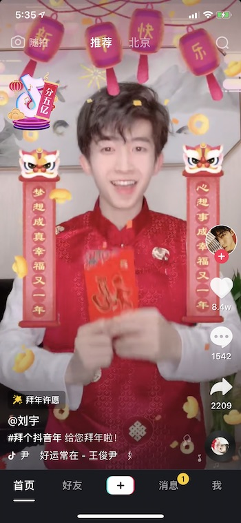
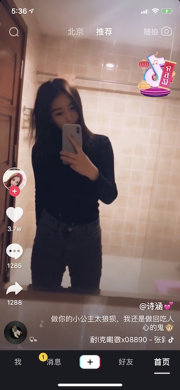
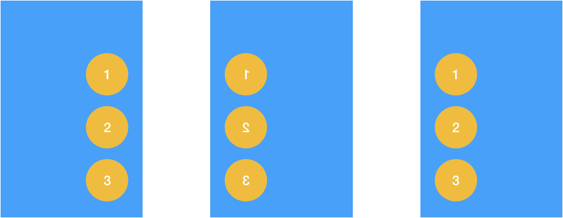
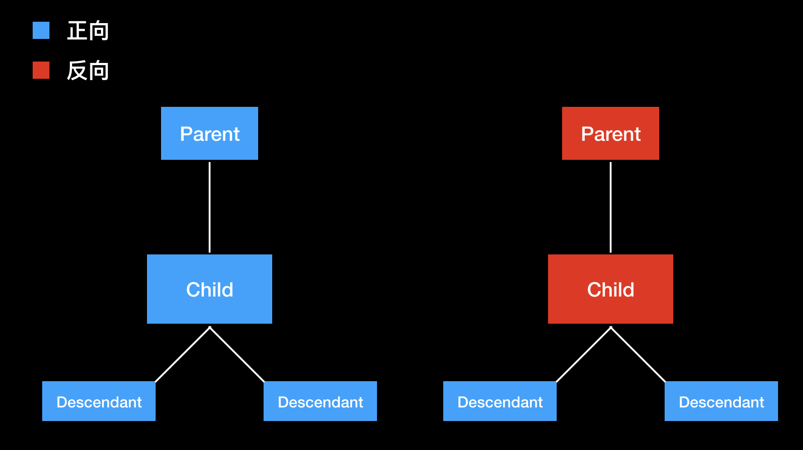
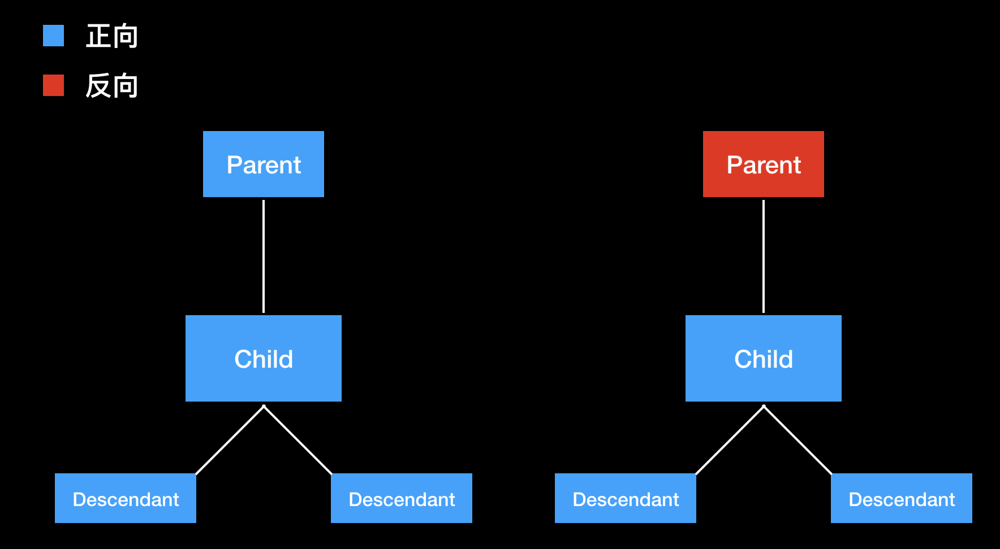
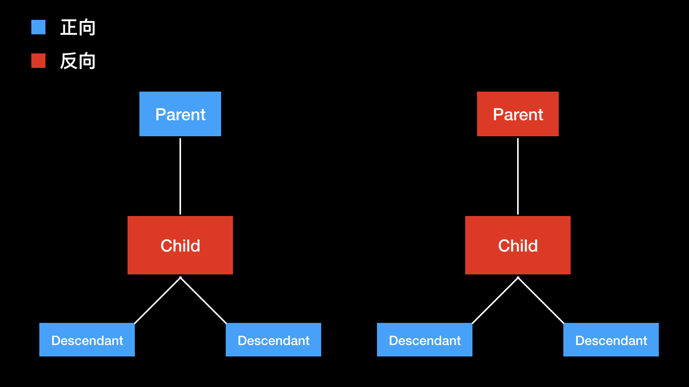
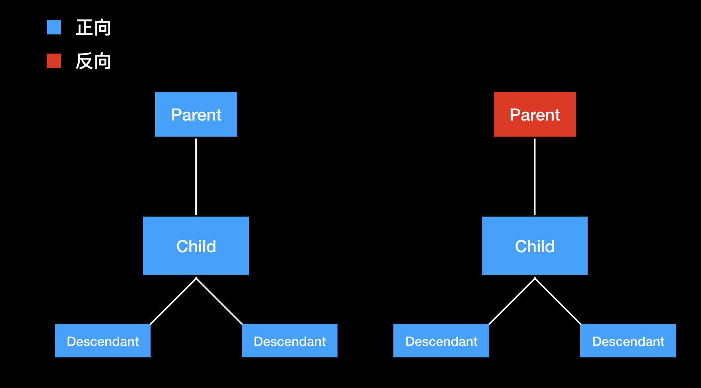
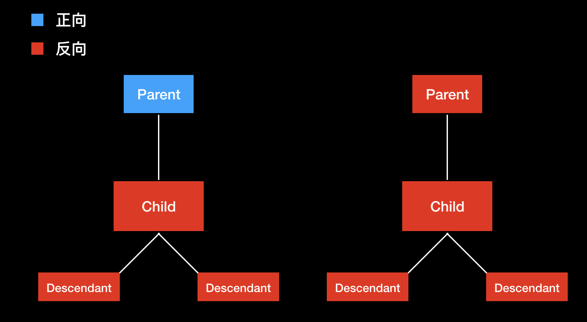

## 接入指南

`pod 'AWERTL'`

```objc
// 设置在 RTL 下需要二次反转的 image names，如方向指示性图片
[AWERTLManager sharedInstance].flipImageNames = @[@"directional_image_name1", @"directional_image_name2"/*, ...*/];
// 在 RTL 环境下，启动 AWERTL
[AWERTLManager sharedInstance].enableRTL = YES;
```

## 什么是 RTL

`RTL` 是 `Right To Left` 的缩写，表示从右向左书写的语言，比如阿拉伯语和希伯来语等。使用这种语言的用户习惯从右往左阅读文本、使用功能。

以抖音为例，下图为普通界面



下图为 RTL 界面



可见，除了文本方向变换成了从右向左以外，各 UI 控件也遵循「先右后左」的摆放规则，交互逻辑也要相应地反向：例如在 push 中新页面从左侧进入，pop 时向左滑动退出等。

## 系统方案

iOS 从 9.0 开始提供了系统方案支持 RTL 界面，主要是提供了 `leading` 和 `trailing` 的 `UILayoutGuide` 来替代需要在 RTL 中翻转的场景下的 `left` 和 `right`，以及 `UIView` 的 `semantic attributes` —— 也就是说在 RTL 环境中，`leading` 等同于 `right`，`trailing` 等同于 `left`，而在一般环境下反之。

系统方案有以下不足：

1. 要想支持 RTL，必须使用 `AutoLayout`

    首先存量代码有大量 `Frame` 布局，改造成本过大；
    
    其次在有些场景下（例如直播弹幕，单列关注），出于性能考虑不可改用 `AutoLayout`
    
2. 需要使用者对该用 `leading` 还是 `left` 有清晰的要求
   
    由于历史原因，项目中大量存量的 `AutoLayout` 代码是 `leading` `left` 不分的，大量使用者直接将 `leading` 替代为 `left` 使用，没有考虑 RTL 场景下的 case。
    
3. 不支持 iOS 8 及以下的系统
4. 交互的适配可能需要大量 If Else，例如 pop 手势左滑还是右滑等

## AWERTL 的原理

AWERTL 使用 Window 镜像的方案来适配 RTL：

1. 将整个 window 以 y-轴为对称轴翻转
2. 将`不可翻转的元素`再次以自身的 y-轴为对称轴翻转
3. 细调各种组件，例如使文本右对齐等



原理很清晰，直接支持元素位置镜像和交互镜像，`AutoLayout` 或者 `Frame` 布局都 ok，该怎么写代码还是怎么写。

关键的问题在于`不可翻转的元素`要如何判别？

1. 文本类元素

    文本类元素无条件需要正面对着观众。因此 UILabel、UITextView、YYLabel 等组件，默认就属于 `不可翻转的元素`
    
2. 非方向指示性的图片

    除了带有左右方向指示性质的图片（例如返回箭头按钮）需要跟随屏幕一起翻转以外，大部分的图片（例如视频封面图）都需要保持正常的方向而非镜像。因此 UIImageView 除非其中的 image 带有左右方向指示性质，否则就属于 `不可翻转的元素`
    
3. 已经用其他方式做了 RTL 适配的页面

    由于在 RTL 环境下，系统会对它提供的一些组件自动做 RTL 适配，因此不需要我们来做二次的镜像适配，它们也属于 `不可翻转的元素`，例如 `系统键盘` `Status Bar` `PHPhotoPickerViewController` 等。此项还包括 `UIWebViewController` `SFSafariViewController` 等，因为前端应当负责进行页面的 RTL 适配。
    
4. 其它业务方希望保持正向的元素
    
    例如视频播放器的页面、录制页的 Camera 试图等。
    
因此，AWERTL 也按照上述的思路来设计 API。

UIView 提供一个 `awertl_viewType` 的属性，默认值为 `AWERTLViewTypeAuto`，表示自动根据上述的规则（1，2，3）来进行 RTL 适配，自行选择合适的方案。除此之外，这个属性还可以被设置为以下几种值：

1. AWERTLViewTypeInherit

    表示继承父元素的方案，这也是大多数 UIView 的 Auto 默认选择的方案
    
    

2. AWERTLViewTypeNormal

    不管父元素的方案，强制正向。比如文本、普通图片、视频播放器
    
    
    
3. AWERTLViewTypeFlip

    不管父元素的方案，强制反向。比如带左右方向指示性的图片
    
    
    
4. AWERTLViewTypeNormalWithAllDescendants

    不管父元素的方案，强制正向，同时强制所有的子元素全部正向。比如系统键盘
    
    
    
5. AWERTLViewTypeFlipWithAllDescendants

    不管父元素的方案，强制反向，同时强制所有的子元素全部反向。在工程中暂无实例
    
    
    
    
## 一句话总结

一般情况下，RTL 会自动适配；如果 RTL 下某个 UIView 反了，通过设置 view.awertl_viewType = AWERTLViewTypeNormal 即可修正

## FAQ

Q: 接入了一个已经用系统方案实现了 RTL 的第三方库，如何兼容？

A: 如果此库提供整个页面 UI，建议通过单独的 UIWindow 使用该库，并设置 `window.awe_rtlviewType = AWERTLNormalWithAllDescendants`；如果此库提供零散的 UI 组件，建议添加组件类的 Catagory，并在其中重写 `- (AWERTLViewType)awertl_automaticViewType` 方法，告知 AWERTL 不处理相关的控件
